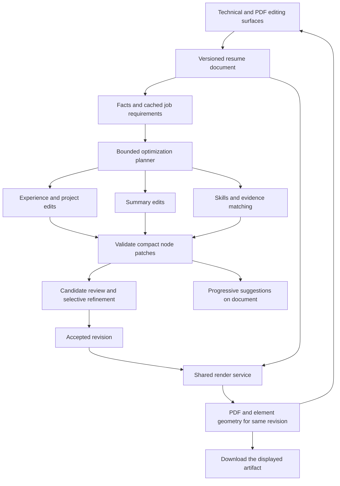

# Latexy PDF and AI resume engine architecture

Latexy should make editing immediate, refresh simple resume PDFs within a one second warm-path budget, and deliver useful AI changes progressively. The current code already has streaming, exact compile caching, section selection, structured builder data, and warm production workers. The next architecture should connect those foundations through versioned resume nodes, compact AI patches, a bounded parallel optimizer, and an independent rendering service.

The first engineering priority is to remove synchronous event publication from compiler and model output consumption, shorten the two second compile debounce, and expose revision-specific artifact readiness. Retain FastAPI while measuring its actual contribution. A framework rewrite does not remove external inference, TeX work, remote storage, or queue delay.

This proposal covers the technical editor, the future PDF-based editing surface, imported resumes, job-description tailoring, contextual memory, effort levels, model routing, deployment, and the migration sequence. The proposed latency numbers below are acceptance targets; they are not current product measurements or guarantees for every custom LaTeX document.

## Evidence and measurement scope

The local checkout was read at commit `317b9b3d0b1cf05cb4a007dbf179129993d67ba5` on October 6, 2026, including concurrent working-copy changes to the visual editor. Source hashes for the principal audited files are recorded in [local measurements](local-measurements.json). GitHub reads initially used snapshot `275a9d28332fc284d803efe51a5139876ffbad02`; conclusions below were checked against the relevant local files. Other project tasks are changing this checkout, so hashes provide the precise scope when line numbers move.

Two local microbenchmarks ran against all 61 shipped `.tex` templates, with 100 calls per template:

| Existing operation | Calls | Median | p95 | Scope |
| --- | ---: | ---: | ---: | --- |
| Python `extract_sections` | 6,100 | 0.3338 ms | 0.9514 ms | Python 3.12.10 on this Windows machine |
| TypeScript `projectVisualResume` | 6,100 | 0.2868 ms | 0.9272 ms | Node 24.19.0, transpiled current implementation |

These measurements exclude application startup, React rendering, browser layout, model calls, PDF generation, and network traffic. The Python parser recognized no sections in 14 templates, including documents with structures outside its `\section` convention. That is a coverage limitation, not proof that those templates cannot compile. The catalog also contains presentations; the eventual interactive resume benchmark must use a separate resume corpus.

Reproduce the measurements from the repository root:

```powershell
& .\backend\.venv\Scripts\python.exe .\docs\audits\latency-2026-10-06\measure_local.py --output .\docs\audits\latency-2026-10-06\local-measurements.json
node .\docs\audits\latency-2026-10-06\measure_visual.mjs
```

The current local PATH has no pdfLaTeX, XeLaTeX, LuaLaTeX, Tectonic, Typst, or Docker. Consequently these results cannot establish production compile latency. The August [compile latency issue](https://github.com/sanskarpan/Latexy/issues/1281) recorded five production runs with a 37.23 second median and substantial pipeline overhead. That is historical evidence. Worker comments describing warm compilation around 3.5 seconds and combined jobs around 40–50 seconds also describe earlier observations, rather than a new baseline.

## Current request paths

The technical editor submits a complete LaTeX string through `apiClient.compileLatex`. The jobs API resolves identity, plan, saved compile settings, quota, and durable job ownership, writes initial Redis state, then dispatches work. Local/container deployments use Celery queues; Modal deployment calls named Modal functions which execute the Celery task bodies with `.apply`. Celery broker tuning therefore does not govern production Modal dispatch.


Combined optimization adds a full-document model rewrite before compilation, then ATS scoring and finalization. Tokens are streamed, but the PDF job ID becomes available through the terminal completion event. Section selection currently changes prompt instructions; it does not create independent section jobs or reduce the requested response to section patches.

The new local `VisualResumeEditor` edits fields projected from LaTeX using original source spans. Its page is a document-like form with a separate PDF preview. This preserves more source than the older parse-and-serialize editor, but it does not yet put editable semantic elements on the exact rendered PDF.

## Code audit findings

| Finding | Code evidence | Consequence and required change |
| --- | --- | --- |
| Auto-compile waits two seconds | [LaTeXEditor](../../../frontend/src/components/LaTeXEditor.tsx), Monaco change listener around line 1202; [editor page](../../../frontend/src/app/workspace/%5BresumeId%5D/edit/page.tsx), visual effect around line 2770 | Automatic refresh cannot meet one second from the last edit. Use a short adaptive debounce with one running compile and one replaceable latest pending revision. |
| Every output chunk waits for Redis | [event publisher](../../../backend/app/workers/event_publisher.py), `publish_event` around line 379; [LLM worker](../../../backend/app/workers/llm_worker.py), chunk loop; [compile worker](../../../backend/app/workers/latex_worker.py), log loop | One atomic Lua call already replaces multiple Redis writes, but each chunk still incurs synchronous network waiting. Introduce bounded buffering and independent publication. Preserve ordering and lifecycle fences. |
| Job admission has serial remote work | [job routes](../../../backend/app/api/job_routes.py), `_write_initial_redis_state` around line 392 and `submit_job` around line 554 | Metadata, sequence, stream, expiry, and Pub/Sub setup use several awaited calls, in addition to database and quota operations. Batch independent writes and use atomic scripts where dependencies require them. Keep the durable admission and charging guarantees. |
| Modal dispatch runs synchronously inside an async request path | [Modal dispatcher](../../../backend/app/core/modal_dispatch.py), `spawn`; callers in job routes | A blocking SDK call can occupy the API event loop. Measure its duration and use an async SDK entry point or a bounded thread handoff while retaining dispatch acknowledgement and recovery. |
| Exact compile cache is already implemented | [compile worker](../../../backend/app/workers/latex_worker.py), `compile_cache_key`, `restore_compile_cache`, `remember_compile_cache` around lines 727–823 | Cache lookup occurs after job dispatch and preparation. It improves repeated identical requests, but source edits miss. Add an authorized fast lookup before scheduling TeX, using the identical canonical input preparation. |
| Combined compilation has a separate implementation | [orchestrator](../../../backend/app/workers/orchestrator.py), `_run_latex_stage` around line 984 | It does not call the compile worker's exact-input cache helpers. Consolidate rendering through one engine adapter so settings, cache policy, and optimizations apply to every route. |
| PDF visibility waits for terminal work | [compile worker](../../../backend/app/workers/latex_worker.py), success path around lines 2316–2440; [orchestrator](../../../backend/app/workers/orchestrator.py), stages around lines 300–583; [stream reducer](../../../frontend/src/hooks/useJobStream.reducer.ts), `job.completed` | PDF text extraction, scoring, persistence, and terminal bookkeeping can delay usable preview. Add a nonterminal artifact readiness contract with authorized artifact access and explicit revision identity. |
| Large artifacts are copied through Redis | [compile worker](../../../backend/app/workers/latex_worker.py), `cache_compile_output` around line 668 | Base64 PDF bytes, decompressed SyncTeX, and cache-hit artifact copies consume memory and bandwidth. Store durable binary artifacts once, keep compact manifests in Redis, and serve authenticated bytes or short-lived authorized URLs. |
| Model generates a complete LaTeX document | [LLM service](../../../backend/app/services/llm_service.py), `_create_optimization_prompt` around line 290 | Even a small content edit regenerates formatting and unchanged text. Return typed node edits, render LaTeX deterministically, and reserve full-document generation for actual conversions. |
| Main optimizer has no evidence ledger | Same prompt and orchestrator call path | User direction, persona, tone, and selected sections exist, but factual support and section ownership are advisory instructions. Add explicit source facts, allowed edits, unsupported requirements, and validation. |
| JD extraction in the optimizer is shallow | [LLM service](../../../backend/app/services/llm_service.py), `extract_keywords_from_job_description` | It lowercases text before a capitalized-term pattern, collects a set, and truncates the resulting list. Requirement importance and evidence are lost; ordering is not stable across processes. Introduce a deterministic requirement representation and cache a semantic extraction once per JD. |
| Style level is being used as the main optimization control | `conservative`, `balanced`, `aggressive` in the LLM prompt | These control how much content changes, rather than time, iterations, model spend, or review depth. Add a separate effort policy with hard request, token, cost, and deadline budgets. |
| Provider behavior is spread across paths | [provider service](../../../backend/app/services/llm_provider_service.py), [LLM worker](../../../backend/app/workers/llm_worker.py), [orchestrator](../../../backend/app/workers/orchestrator.py), [BYOK routes](../../../backend/app/api/byok_routes.py) | The main streaming workers call an OpenAI-compatible SDK directly; the general provider abstraction has a different path and its HTTP endpoint rejects streaming. Unify adapters and test provider-specific schema, reasoning, cancellation, and usage behavior. |
| Retry policy can add minutes | LLM worker uses 120 second general retry countdowns; combined task uses exponential delays starting at 60 seconds | Whole-task retries can repeat completed expensive work. Persist stage results, retry only transient failures within a run deadline, and expose partial usable results. Honor provider rate limits. |
| A single warm worker does not cover bursts | [Modal app](../../../backend/modal_app.py), `run_latex_task`, `run_orchestrator_task`, `run_llm_task` around lines 280–337 | Compile and combined functions have `min_containers=1`; standalone LLM has no warm minimum. Add measured warm capacity and burst buffers. No explicit region is configured on these decorators. Verify actual placement against Redis, DB, storage, and users. |
| Warm containers still initialize Redis per invocation | Modal `_init_worker_redis`; publisher `initialize_worker_redis` around line 316 | Initialization creates and pings a new client and closes the old one. Move reusable clients to process startup with reconnect handling and correct per-user provider credential isolation. |
| Current timing can misidentify compiler and cold-start cost | Compile loop measures from `Popen` through synchronous log consumption; `consume_cold_start_seconds` measures time since module import | The subprocess duration includes event-drain waiting and cannot isolate raw TeX CPU work. Module-import elapsed time does not measure image pull or total platform boot. Add raw process-exit, output-drain, publication, and platform startup measurements. |
| WebSocket recovery has a four second cadence | [job stream hook](../../../frontend/src/hooks/useJobStream.ts), `POLL_INTERVAL_MS=4000` | A missed completion event can introduce another polling interval. Use immediate recovery on reconnect and an adaptive bounded fallback rather than frequent unconditional polling. |
| PDF loading hides the previous page | [PDFPreview](../../../frontend/src/components/PDFPreview.tsx), early `isLoading` return | Preserve the last completed PDF, show an updating state, and swap only when the new artifact is ready. Keep draft revision and rendered revision visible to export logic. |
| Node identity is not yet sufficient for parallel edits | [visual projection](../../../frontend/src/lib/wysiwyg/visual-projection.ts), index-derived IDs; [older document model](../../../frontend/src/lib/wysiwyg/document-model.ts) | Inserting or reordering content can change projected IDs; the older model lacks persistent per-node identity. Extend the builder's existing entry and bullet IDs into the shared document contract. |
| ATS scoring failure can resemble a real poor score | Orchestrator `_run_ats_stage` returns `0.0, {}` on exception | Represent unavailable analysis explicitly. Resume quality should not be presented as zero because an analysis stage failed. |

The richer ATS scoring, deep analysis, semantic matching, section reorder, diff review, collaboration guards, and structured builder services remain useful. The limitation is that the main optimization path does not integrate them into a bounded, evidence-based editing loop. Its current prompt-driven full rewrite cannot deliver the whole intended experience by itself.

## What can explain the observed slowness

For a plain compile, the visible delay is approximately:

```text
debounce + admission + dispatch/queue + initialization + TeX/output drain
         + artifact publication/finalization + download + first PDF paint
```

For combined optimization, add model prefill, reasoning, output generation, synchronous event drain, and ATS/review stages. Some work overlaps, so sum-of-spans accounting must avoid counting the same interval twice.

Consider 1,200 output chunks with an assumed Redis round trip of 20 ms: serial publication alone requires about 24 seconds of waiting in the consumer loop. Two hundred compiler log lines at the same assumed round trip require about four seconds. These are sensitivity calculations from the code structure, not observed production event counts or RTT. Provider generation can overlap while the consumer waits; publication delays can also backpressure a compiler when its output pipe fills. Instrumentation must establish the net end-to-end effect.

The primary sources support removing repeated round trips, reducing generated output, and using bounded parallelism. They do not establish that any named language or provider will make this product the fastest. [Redis pipelining](https://redis.io/docs/latest/develop/using-commands/pipelining/) explains the round-trip cost; [OpenAI latency guidance](https://developers.openai.com/api/docs/guides/latency-optimization) identifies output generation, request count, and independent parallel work as optimization targets.

The local parser measurements provide no reason to treat Python as the principal bottleneck. FastAPI can support concurrent I/O when awaited correctly, and external TeX runs in its own process. Audit blocking calls before changing the framework. [FastAPI concurrency documentation](https://fastapi.tiangolo.com/async/)

## Latency targets and product promises

Define separate service-level indicators from the user's action to useful output. A progress event is not an optimized bullet; cached output is not a fresh uncached compile.

| Operation | Engineering target | Qualification |
| --- | --- | --- |
| Local text edit on document surface | p95 below 100 ms | Immediate local model/input update; separate browser layout measurement |
| Warm local section projection | p95 below 10 ms | Already below 1 ms in the local microbenchmarks; verify supported large imports |
| Job acceptance | p95 below 250 ms in the selected region | Includes authentication and durable admission, excludes model/compile completion |
| Cached PDF first paint | p95 below 500 ms on the defined network | Includes authorization, retrieval, and first page rendering |
| Fresh simple resume PDF after committed edit | p50 below 750 ms; p95 below 1 second as the final target | Warm worker, certified template, bounded assets, defined network and device profile |
| First PDF milestone during migration | p95 below 2 seconds | An intermediate gate; does not satisfy the final one second goal |
| First validated AI suggestion | p50 1–3 seconds; p95 below 5 seconds | Selected content, warm cached context, short output; cold JD analysis reported separately |
| Quick optimization completion | 15 second run budget plus final render/commit | Bounded scope and request count; partial results at the deadline |
| Standard optimization completion | 40 second run budget plus final render/commit | Targeted section passes and one global review |
| Deep optimization completion | 90 second run budget plus final render/commit | More alternatives and selective refinement; no minutes of silent retry |

These are proposed budgets that must be calibrated with real provider and deployment measurements. One second fresh PDF latency remains a stretch gate until actual TeX runs are measured independently. Arbitrary custom macros, large assets, bibliography work, font-heavy CVs, cold starts, and long network paths need separate budgets. Literal zero latency and subsecond completion of a substantive remote AI rewrite are not credible universal promises.

Describe the product around immediate editing, rapid preview, and progressive evidence-based optimization. Claim competitive speed leadership only after a reproducible comparison with equivalent documents and operation scopes. Overleaf documents `latexmk`-based compilation and a fast mode which skips image processing; those documents do not establish a universal subsecond competitor baseline. [Overleaf compilation documentation](https://docs.overleaf.com/getting-started/recompiling-your-project)

## Target document and rendering architecture

Use a shared versioned resume document with persistent IDs for sections, entries, bullets, and editable fields. Extend `Resume.structured_content` and the builder's existing stable IDs rather than introducing a disconnected second resume store. Add a content concurrency revision distinct from `structured_version`, which should retain its schema-version meaning.

Managed templates can make structured content authoritative and generate LaTeX through deterministic adapters. Imported/custom LaTeX retains the original source as authority, with a conservative editable projection and opaque blocks for unsupported constructs. Keep source ranges and a source hash for each projection. A source edit reparses affected ranges, reconciles identities, and invalidates only dependent analyses. Never claim arbitrary TeX can be losslessly interpreted by a small regex parser.

The minimal common contract is:

```text
ResumeDocument
  document_id, owner_scope, schema_version, content_revision
  source_mode: managed | imported
  template_id, template_version, renderer_version, language
  sections: [{id, kind, order, entries: [{id, fields, bullets: [{id, text}]}]}]
  source_projection: {source_hash, node_to_source_ranges, opaque_blocks}
  facts: [{id, value, source_node_id, source_revision, confirmation_state}]
  preferences: {tone, target_seniority, page_target, locked_node_ids}
```

An extracted fact is a statement found in the user's material, rather than independently verified employment history. Record that distinction. New metrics, technologies, dates, seniority claims, and qualifications require supporting source material or user confirmation before inclusion.



Make rendering a shared service used by editor compile, combined optimization, builder, public trial, previews, and export. Keep authorization and quotas in admission, and return a revision-bound artifact manifest from rendering. The manifest contains content hash, engine image digest, compiler/settings hash, template/font/asset versions, PDF storage reference, and source/geometry mapping references.

## Making PDF compilation fast

1. **Remove event transport from the TeX output drain.** Drain bounded stdout immediately, scan safety-sensitive output synchronously, accumulate local logs, and queue small publication batches independently. A 25–50 ms flush window and a bounded byte threshold are initial values to benchmark. Keep full bounded logs for diagnostics. Sequence batches and flush them before terminal events. Do not drop result/ownership transitions to save time.
2. **Coalesce preview requests.** Keep at most one running render per document and one replaceable pending preview revision. A 150–250 ms initial debounce permits fast updates; adapt to measured compile time. Retain explicit exports and user-created checkpoints as separate durable requests. Source edits arriving during compilation should result in the newest revision rendering next.
3. **Move exact cache reuse ahead of dispatch.** Apply the same canonical preprocessing and authorization before computing the key. Include the owner, complete settings, bibliography and asset hashes, engine image digest, and renderer epoch. Reuse an authorized immutable artifact manifest without copying the PDF to another Redis key. Coalesce simultaneous identical inputs through a bounded lease and recover after owner failure.
4. **Keep actual rendering capacity warm.** Use a small certified resume image with necessary preinstalled packages/fonts and existing TeX format/font caches. Choose CPU and warm pool size from isolated measurements. Use separate capacity for heavy CVs, presentations, and deep AI. A single idle worker does not absorb concurrent spikes. Modal's warm minimum and buffer settings trade idle cost for queueing latency. [Modal cold-start guidance](https://modal.com/docs/guide/cold-start)
5. **Reduce network distance.** Measure API-to-Redis, worker-to-Redis, worker-to-storage, and API-to-DB RTT. Pin compatible locations where that improves the measured path, while checking regional capacity. Do not infer actual regions from decorators alone. [Modal region selection](https://modal.com/docs/guide/region-selection)
6. **Reuse scoped build state where it helps.** Preserve bounded auxiliary state for a document session, keyed by content dependencies and engine version. Existing workers delete their job directories, so current result caching is not incremental compilation. Clear state on preamble/compiler/assets changes, isolate document workspaces, and serialize access. Persistent workspaces do not make classic TeX a truly incremental compiler.
7. **Use appropriate pass policy.** Current main loops invoke the selected engine once. Certified resume templates without cross-references can use one pass; templates with citations/references need convergence rules. Cache package/formats, and benchmark a template-specific preloaded format only when its dependency hash is stable. Splitting source into `\input` sections does not make PDF layout independently composable.
8. **Publish an artifact as soon as it is safe and accessible.** Complete recorder/read confinement checks, bind the artifact to its owner and revision, persist the minimum manifest, then emit `artifact.ready`. Final scoring, checkpoint indexing, and notifications can follow. Export and share require their authoritative durable state; preview readiness must not masquerade as final success.
9. **Keep the old PDF visible while updating.** Prefetch supported renderer code and retain the latest verified page. Cancel superseded PDF loads and render only visible pages first. A stale artifact can be shown as the previous revision but cannot silently stand in for the newly edited export.

Keep existing sandbox limits, cancellation, lifecycle ownership, quotas/refunds, and read-escape checks. They are concrete invariants of the current implementation. Optimize how the work is scheduled and transported without bypassing those invariants.

## The direct PDF editing surface

Build editable overlays on the rendered pages, keyed by semantic node IDs and geometry for the exact PDF revision. Click a bullet, role, date, skill, or section heading to edit that node. Selection, section navigation, drag/reorder handles, AI suggestions, and accept/reject controls all reference the same document nodes.

The renderer must emit a node-to-source map and a node-to-page geometry map. SyncTeX is useful for locating source regions, but it is a synchronization mechanism, not a semantic map of resume fields. Combine template-aware source mappings with compiler-supported position instrumentation or verified text/geometry matching. Handle one field spanning several lines, macros producing multiple boxes, links, ligatures, columns, rotated pages, zoom, and script direction. Use adapters per engine/template and test ambiguous hits. [TeXworks synchronization](https://tug.org/texworks)

An active overlay updates locally immediately. Surrounding layout reflows when the authoritative renderer returns the new revision. Display the updating state and retain the last complete PDF until then. Download returns the same immutable PDF bytes shown for that revision. If the draft has newer edits, compile that draft or explicitly use the displayed prior revision; never silently export stale content.

For managed templates, add a local layout preview only if it materially improves interaction, and verify it against the authoritative output. A browser HTML facsimile cannot guarantee TeX-identical line breaks, pagination, or fonts. A fully instant reflowing editor needs one layout engine for both the surface and exported PDF, with that engine's supported template scope clearly defined.

Import PDFs into a document model with extraction confidence, preserved original attachment, and explicit template adaptation when needed. Arbitrary uploaded PDF bytes do not reveal the original editable semantic structure or reconstruct the original TeX reliably. Preserve the original appearance until the user chooses a supported adaptation.

## The AI optimizer and contextual memory

### Prepare context once

At load/import/template selection, build a section and node index, a source-linked fact ledger, local quality signals, and a compact document summary. Reuse the structured builder where available. Compute expensive embeddings or deeper analysis in the background only when the feature needs them. A one or two page resume can usually retrieve facts through direct node/index lookups; a vector database need not be on the interactive path.

Parse each job description into requirements with IDs, source excerpts, importance, skill aliases, responsibilities, seniority, and constraints. Distinguish required from preferred qualifications and distinguish evidence in the resume from missing evidence. Fast deterministic extraction can start immediately; one bounded semantic call resolves ambiguity. Cache it by normalized JD, language, extraction version, and authorized scope. Reuse it across sections and revisions.

Context per section includes the relevant requirements, relevant original facts, original section nodes, the shared style/page plan, user directions, immutable facts, and allowed node IDs. The section worker receives actual evidence, not only a remembered summary. Store accepted choices, rejected alternatives, confirmed facts, and user preferences in versioned records. Invalidate dependent entries after edits or a new target role. Avoid unbounded chat history and model-written memory as a substitute for source facts.

### Plan and run bounded parallel tasks

Choose work from the requested scope and the requirement-to-evidence map. Quick edits can reuse an existing plan or make a deterministic selection. A mandatory model planner on every bullet would add an unnecessary sequential request. Use a model planner when the scope or deep effort warrants it.

Start with two to four concurrent requests, each covering a meaningful section or a small group of closely related nodes. Group tiny sections to avoid excessive request overhead. Apply provider RPM/TPM limits, tenant fairness, warm capacity, and run deadlines. Large experience sections may split into entry groups; arbitrary one-request-per-bullet fan-out can be slower and more expensive.

Section workers propose changes against an immutable base snapshot. They share a requirement coverage plan and evidence IDs. Skills may propose reordering supported skills; they cannot add a required technology merely because the JD mentions it. Summary generation uses the shared factual plan and is checked against experience. If accepted experience changes affect the narrative, revalidate the summary or rerun only those affected nodes.

Parallel duration is closer to preparation plus the slowest scheduled section group plus review/render, rather than the sum of section times. Provider saturation, queue limits, and uneven section sizes constrain that benefit. Measure it against a single compact call on the same scope.

### Return typed patches

The model proposes a compact operation rather than emitting the document preamble, macro definitions, unchanged sections, and explanatory essays:

```json
{
  "base_revision": 42,
  "changes": [{
    "node_id": "bullet_7d8c",
    "expected_node_revision": 5,
    "operation": "replace_text",
    "text": "Improved replacement supported by the supplied experience.",
    "evidence_ids": ["fact_18"],
    "requirement_ids": ["jd_req_3"],
    "reason_code": "clarity_and_relevance"
  }],
  "missing_evidence": ["jd_req_9"]
}
```

The server validates schema, allowed operations and nodes, node revision/hash, protected fields, evidence references, text length, and forbidden syntax. Renderer escaping creates valid LaTeX. Factual checks include exact dates, names, numbers, credentials, and supported skill claims; semantic support checks handle subtler overstatements. A model-provided evidence ID is an assertion to verify, not proof of entailment.

Structured output constrains shape on supported models, but it does not establish truth and refusals/incomplete responses still need handling. Adapters must declare actual support. [OpenAI structured output documentation](https://developers.openai.com/api/docs/guides/structured-outputs)

Do not apply incomplete streamed JSON or raw LaTeX fragments. Validate a completed change record or completed section response, then publish it. Batch content deltas for visual progress separately from authoritative operations. Render coherent accepted changes in coalesced batches, rather than recompiling every generated token.

Use optimistic concurrency at node level. Disjoint edits from the same snapshot can merge when their target node revisions still match. A user edit to the same node creates a conflict; preserve the user's newer text and discard or refresh that suggestion. Recheck global facts and requirements after any permitted merge. Keep current owner/session, collaborative edit, and staged AI candidate protections.

### Review the whole candidate

Run deterministic consistency, missing evidence, duplicated claims, length, and required section checks. A global reviewer sees the candidate and source-linked evidence, checks narrative consistency and relevance, and returns a short list of issues and corrective patches. It does not rewrite the entire resume again.

Refine only flagged nodes while keeping accepted improvements visible. Finish with exact PDF layout/text checks: overflow, page count, readable font/spacing, extraction order, and links. Keep source-based content analysis and actual PDF extraction analysis distinct. The current combined ATS stage scores the LaTeX and cannot certify the exported PDF's reading order.

A stronger product than a generic chat rewrite can show which requirement an edit addresses, the supporting experience, what remains unsupported, layout fit, alternatives, and reversible decisions. Missing facts can be surfaced as targeted follow-ups while supported improvements continue. Avoid inventing metrics to make a bullet appear stronger.

### Cache and choose providers deliberately

Keep shared instructions, schema, evidence policy, and reusable context stable; append changing node inputs. Measure cache hits for the specific model/API rather than assuming a shared prefix always yields reuse. Prompt caching reduces input processing and does not eliminate output generation. [OpenAI prompt caching documentation](https://developers.openai.com/api/docs/guides/prompt-caching)

Add a provider-neutral `optimize_nodes` adapter with capability checks for structured output, streaming, reasoning controls, cancellation, usage, cache accounting, and errors. Reuse SDK connections within the appropriate credential scope. Record the actual provider as well as the model; a Gemini call through an OpenAI-compatible client is still a Gemini call.

The current compatibility path sends `reasoning_effort="none"` through `extra_body`. Verify the exact deployed model and SDK request shape before changing it: Google's documented thinking controls and ability to disable thinking differ by model family. Map application effort through provider capabilities, rather than forwarding one universal setting. [Gemini OpenAI compatibility](https://ai.google.dev/gemini-api/docs/openai.md)

Evaluate a fast capable model for short evidence-grounded edits and a stronger reviewer only where quality measurements justify it. Pin production models and prompt/schema versions. Routing decisions must combine quality, p95 first usable change, full completion time, malformed/refusal rate, rate limits, and cost per accepted improvement. Provider throughput advertisements cannot substitute for this workload benchmark. BYOK fallback must honor the user's provider and spending choice.

## Effort policy and cost control

Effort is independent of style aggressiveness and tone. Users choose Quick, Standard, or Deep; they may separately request conservative or substantial changes. Plan entitlements limit budgets without secretly changing the meaning of an effort level.

| Effort | Initial scheduling policy | Total model request cap | Parallel request cap | Review and refinement | Run deadline |
| --- | --- | ---: | ---: | --- | ---: |
| Quick | Selected nodes or highest priority section groups | 4 | 2 | Deterministic checks; optional short review within cap | 15 s |
| Standard | Relevant sections with shared coverage plan | 8 | 3 | One global review and selective correction within cap | 40 s |
| Deep | Broader alternatives and difficult requirement matching | 14 | 4 | Up to two review/refinement rounds within cap | 90 s |

Caps count JD extraction when uncached, planning, section calls, reviews, and retries together. They are initial policies to tune, not a guarantee that 14 calls fit every 90 second run. Every run also has a server-enforced input/output token ceiling and maximum spend, calculated from actual adapter pricing. Reserve budget before fan-out, account for hidden reasoning and retries when reported, and release unused reservations. High effort increases permissible useful work; it cannot guarantee a better result for every resume.

Stop when checks pass and extra changes have low expected benefit, when the accepted-change/quality metric stops improving, or when any budget is reached. Cancel outstanding provider work where supported and reconcile any late usage. Return valid completed suggestions at the deadline with an explicit partial status. Allow continuation from cached stage outputs; do not restart the entire document by default.

Use model reasoning depth for genuinely ambiguous planning/review tasks. Routine extraction, escaping, section indexing, repeated detection, and change application should use deterministic code. Display time/cost ranges derived from observed policy outcomes; current hardcoded estimated times are insufficient.

## Runtime and renderer decisions

| Option | Benefit | Constraint | Decision |
| --- | --- | --- | --- |
| Keep FastAPI with correct async I/O | Reuses current auth, billing, data, lifecycle, and validation infrastructure | Blocking SDK work and serial calls still require correction | Preferred control plane for this migration |
| Warm TeX service | Retains current template, macro, font, language, and technical-editor compatibility | Classic TeX still lays out the full document | Default authoritative renderer; optimize and measure first |
| Tectonic | Bundled dependency/cache behavior and automatic convergence | Cold dependency downloads and package/font compatibility require validation | Benchmark with a prewarmed offline bundle; no automatic substitution |
| Browser TeX in WebAssembly | Removes server scheduling and network from local preview after warm-up | Download size, mobile memory/CPU, package parity, worker isolation, maintenance and distribution terms | Optional experiment for certified templates |
| Typst service or browser renderer | A compiler designed for incremental recomputation | New syntax/template engine, source interoperability and language/font parity | Pilot only for managed templates if TeX cannot meet the measured target |
| HTML with Chromium PDF export | Easy semantic editing and browser integration | Separate browser printing behavior and TeX layout mismatch | Suitable for a distinct managed renderer if explicitly selected |
| Go or Rust gateway | Can help a measured CPU/connection bottleneck | Does not reduce model generation or external TeX time by itself | Consider only after profiling isolates a remaining gateway bottleneck |

Tectonic documents warm caches and first-build downloads; a warmed bundle is essential in a latency comparison. SwiftLaTeX demonstrates pdfTeX/XeTeX in WebAssembly with optional visual editing still described as work in progress; its repository uses AGPL-3.0, which affects adoption planning. Typst documents incremental recompilation in watch mode. Those are capabilities to benchmark, not evidence of drop-in compatibility or one second performance for Latexy. [Tectonic build behavior](https://tectonic-typesetting.github.io/book/latest/getting-started/first-document.html), [SwiftLaTeX repository](https://github.com/SwiftLaTeX/SwiftLaTeX), [Typst repository](https://github.com/typst/typst)

Chromium's PDF API uses print CSS unless media is changed, so screen appearance requires deliberate parity testing. [Playwright PDF API](https://playwright.dev/docs/api/class-page#page-pdf)

Choose renderer migrations only after a fixture matrix covering the shipped resume templates, custom macros, supported fonts, Hindi/Indic, CJK, RTL, links, extraction order, and one/two-column layouts passes. A new managed engine must generate its technical view from that same engine or expose the compatibility limits of a LaTeX adapter; silently claiming arbitrary LaTeX round-trip fidelity would break the product promise.

## State events and persistence

Add typed `context.ready`, `optimization.section.ready`, `optimization.patch.ready`, `optimization.review.ready`, and `artifact.ready` events. Each includes document ID, content revision, run ID, attempt/branch identity, ordered sequence, and the relevant node/artifact hash. Keep terminal completed, partial, failed, and cancelled states distinct.

Persist the run's base revision, JD/context hashes, effort policy, provider/model versions, approved scope, budget, stage outputs, and accepted/rejected patches. Use existing durable job ownership and finalization infrastructure as the foundation. Child tasks need scoped ownership and resumable completion records; a parent task failure must not trigger duplicate paid calls for already completed sections.

Keep terminal and patch decisions replayable. High-frequency visual deltas may be coalesced; on reconnect recover the current authoritative run snapshot and ordered patches. Current approximate stream trimming can remove early token events during long outputs, so raw token replay cannot be the only way to reconstruct a document. Flush pending batches before readiness/terminal events and fence publishers after cancellation.

Keep artifact manifests separate from result status. A preview artifact can be ready before review completion, but remains bound to the candidate branch and exact revision. User acceptance creates the authoritative edited revision. Never display an unaccepted AI candidate as the saved resume or export it silently.

## Observability and benchmark plan

Instrument browser actions through backend admission, dispatch, worker stages, artifact retrieval, and first PDF paint with a shared trace ID. Collect these intervals:

| Path | Required spans and indicators |
| --- | --- |
| Editing/render | Input-to-local-paint, debounce, submit, queue, platform boot, preparation, process start/exit, output drain, event publication, artifact ready, storage commit, download, first PDF page render |
| AI | Context/JD cache hit, planning, queue, provider first byte, first validated patch, output/hidden tokens, section completion, verification, review, corrections, render and final accepted artifact |
| Capacity/cost | Redis RTT and command count, buffered bytes/backpressure, queue age, worker busy fraction, warm/cold classification, concurrent sections, provider throttles, retry count, spend per run and accepted patch |
| Correctness | Conflict rate, stale artifact rejection, unsupported parser blocks, factual support failures, truncated/refused/malformed responses, PDF overflow and extraction order failures |

Use monotonic timers for durations within a process; use trace spans and server timestamps carefully across machines. The current import-time cold-start proxy should not label image pull latency. Report separate p50/p95/p99 histograms for cached and uncached renders, warm and cold runs, template classes, regional paths, provider/model, effort, and actual output size. Keep sensitive text and unbounded document IDs out of metric labels.

Build a controlled benchmark corpus from generic and consented/redacted fixtures. Include a single changed bullet, section rewrite, whole resume tailoring, long CV, multilingual resumes, unsupported macros, citation/asset cases, fresh imports, and burst workloads. Measure warm single user, cold deployment, and concurrent 10/50-user bursts on defined hardware/network profiles. Collect enough runs per important bucket for useful p95 estimates; a five-run median cannot establish a reliable tail-latency promise.

For AI quality, compare the current optimizer, the new engine, and a strong single-call chat-style baseline on identical source evidence and JDs. Blind-review supported relevance, factual accuracy, clarity, duplication, specificity, and voice; also measure accept/reject rates, unnecessary edits, and export validity. ATS heuristics are diagnostics rather than hiring-outcome labels. Do not train or select the engine solely to maximize its own ATS score.

Required correctness cases include concurrent user/AI edits to the same and different nodes, partial section failure, truncation, throttling, budget exhaustion, reconnect/replay, duplicate dispatch, cancellation during generation/publication/compile, stale cache/artifacts, renderer version changes, and storage failure. Existing lifecycle, ownership, refund, and staging tests are relevant regression gates for the implementation.

## Migration order and exact code surfaces

| Phase | Implementation surfaces | Deliverable and exit gate |
| --- | --- | --- |
| 0. Establish the baseline | `core/observability.py`, `core/tracing.py`, worker timing, `useJobStream`, PDF preview and browser telemetry | A trace accounts for the complete user wait, distinguishes raw engine work from event drain, and identifies current deployed commit/model/regions. |
| 1. Remove avoidable latency | `event_publisher.py`, LLM/compiler loops, `job_routes.py`, `modal_dispatch.py`, `modal_app.py`, Monaco and visual debounce | Buffered publication preserves fences/order; admission batches calls; latest pending preview wins; measured warm PDF p95 reaches the intermediate two second gate or identifies the remaining engine floor. |
| 2. Unify rendering | Compile worker/orchestrator/legacy services/routes, `models/event_schemas.py`, download routes, stream reducer, PDF preview | One renderer adapter, authorized early cache reuse, artifact readiness, exact revision export, and shared cache/settings behavior across entry points. |
| 3. Establish shared nodes and context | Builder service and `Resume.structured_content`, `visual-projection.ts`, source parser, editor state | Persistent node IDs, explicit content revision, conservative source adapters, cached JD requirements, source-linked facts, and safe edits for certified templates. |
| 4. Introduce compact AI edits | Provider adapters, new resume engine service, optimize routes/workers, change review components | A single short patch path outperforms the current full rewrite on accepted quality and latency, with supported factual claims and deterministic LaTeX output. |
| 5. Add bounded parallel optimization | New engine planner/context/patch/review/budget modules, job child-stage persistence, quota accounting | Two-to-four concurrent groups, selective retries/refinement, Quick/Standard/Deep budgets, useful partial outcomes, and quality improvement against the same baseline. |
| 6. Build the PDF surface | `VisualResumeEditor`, `PDFPreview`, SyncTeX/source mapping, renderer geometry adapters | Clicking rendered content edits the correct semantic node; the shown accepted PDF and downloaded bytes are the same artifact; keyboard/mobile/script/column fixtures pass. |
| 7. Meet the final latency gate | Warm pool/resource placement, template render tuning; optional alternative renderer pilot | Certified simple resumes reach fresh warm PDF p95 below one second under the published profile, with equivalent correctness and burst coverage. |

Suggested new backend modules are `services/resume_engine/document.py`, `context.py`, `requirements.py`, `planner.py`, `patches.py`, `review.py`, and `budgets.py`, plus `services/render_engine/` adapters. Suggested frontend modules are a shared document store, a revision-aware render coordinator, and PDF element overlays. These are proposed file locations, not implemented components.

Add database migrations for explicit content revisions and run/stage records while reusing structured resume storage and durable ownership. Keep the current whole-source APIs during transition and route certified templates into the new path behind flags. Avoid editing the several-thousand-line editor page as the sole home for the new engine. Extract the document, rendering, and optimization coordinators into focused modules.

The research and local microbenchmarks are complete. Production speed improvements, new events, shared document contracts, effort policies, and PDF overlays require the implementation phases and deployment benchmarks above. The most defensible first change is the measured fast-path work, followed by compact validated AI patches and shared revision-aware rendering; stack replacement remains contingent on evidence.
