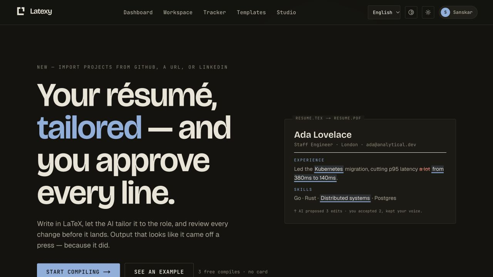
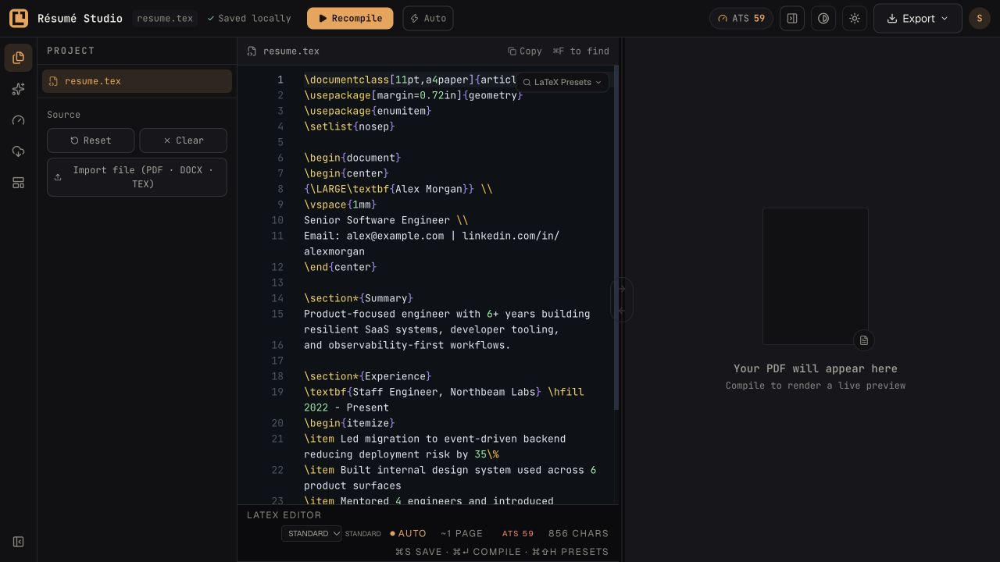
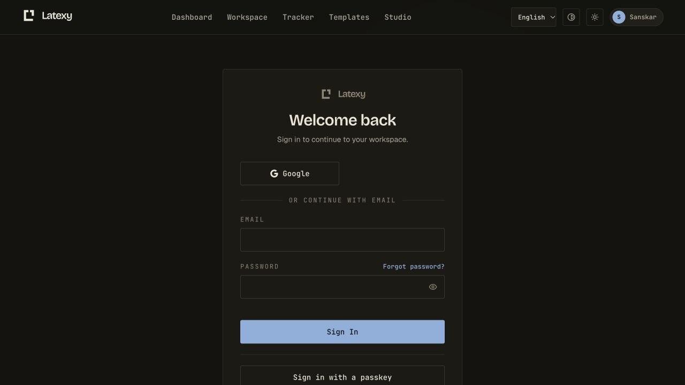

# Production QA checkpoint — October 8, 2026

This is a bounded read-only browser/API audit, not complete product acceptance.
The production frontend identity matched deployed main
`0d628cba165279caa3612716a17a82ec7bdb81b3`. Backend readiness reported database,
Redis and cache healthy. Google was enabled in the provider endpoint.

## Captured flow

Screenshots were captured in the signed-in in-app browser at 1280×720, saved,
and inspected again from disk. The visible source is the synthetic Alex Morgan
sample, not a customer resume. Existing sessions were not reset and no password,
payment, model invocation, compile submission or customer-data write was made.

### 1. Landing — usable; timing copy needs correction

The main call to action is visible and opens `/try`. The headline, sample resume
and actions have a coherent hierarchy. The viewport does not establish mobile
reflow, measured contrast or keyboard accessibility.

The current live DOM and matching source contain “Sub-second compiles” and a
static “compiled 0.8s” label below this viewport. The historical evidence in
[issue #1281](https://github.com/sanskarpan/Latexy/issues/1281) describes an
approximately 0.8-second **TeX stage**, while the asynchronous user-flow sample
had a 5.47-second median. Those are different measurement boundaries. This is
a copy/provenance issue, not a newly measured performance regression.
[Issue #1845](https://github.com/sanskarpan/Latexy/issues/1845) tracks neutral
preview wording and a regression against those unqualified timing claims.

### 2. Studio — route and empty state usable; compile acceptance untested

The landing action opens the actual source editor with the synthetic sample,
visible Recompile/Auto/Export controls and an explanatory empty preview. Source
and PDF synchronization buttons are disabled before a rendered PDF exists.
The control surface is dense; this pass does not certify focus order, zoom,
mobile layout, source-to-PDF mapping, quota behavior or preview latency.

### 3. Sign-in — Google control visible; fresh OAuth acceptance untested

The settled page shows Google, labelled email/password fields and a passkey
action. The initial snapshot lacked Google while provider state was loading;
the settled snapshot and screenshot show it. An existing signed-in session was
present. Neither that session nor `google=true` proves a fresh OAuth callback,
consent flow, account linking or cross-owner isolation, and none is claimed.

## Repair verification and next gates

The narrow homepage regression failed before the copy correction and both
tests passed afterward; targeted ESLint and the existing public-claim guard
passed. This local focused run borrowed the installed Node 22 dependency tree;
the required frozen-lock GitHub build/test checks remain the release authority.
The homepage-only ownership verification, layout and `/try` links are preserved.

The engine and Dodo drafts remain separate and unmerged. Their own release
follow-up documents retain source boundaries, failed runs and outstanding
security, cross-browser, renderer-image, currency and combined-release gates.
Next QA should use isolated synthetic records for actual compile/recovery and
authorization flows, followed by fresh production acceptance of each merged fix.
