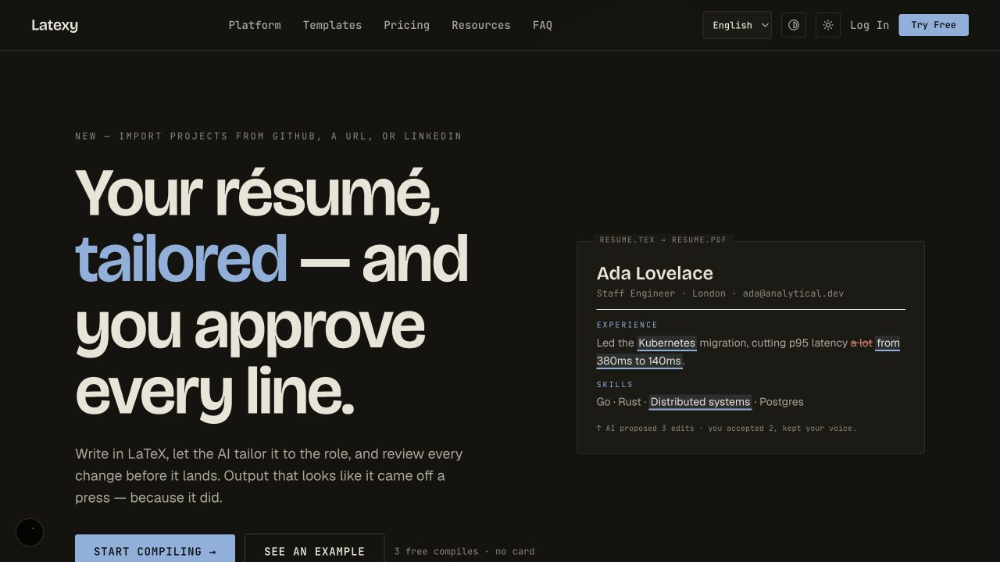
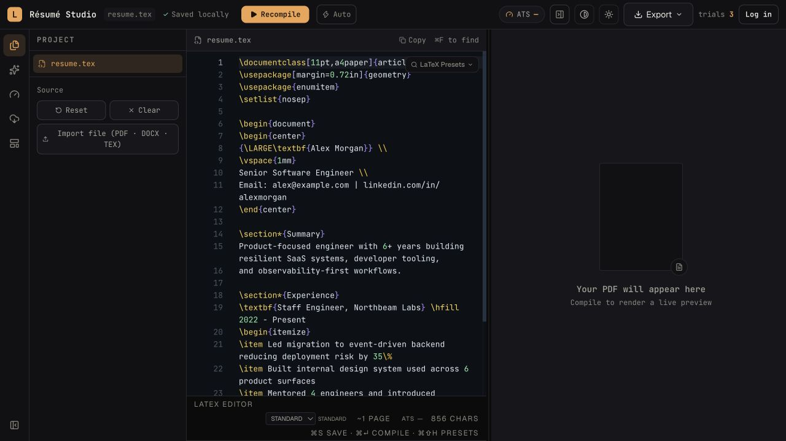
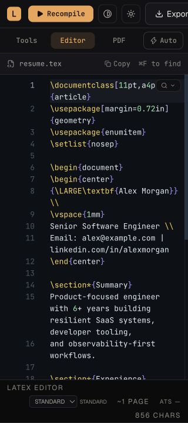
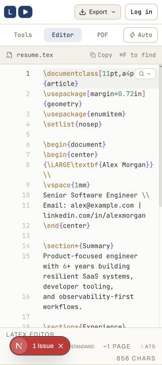
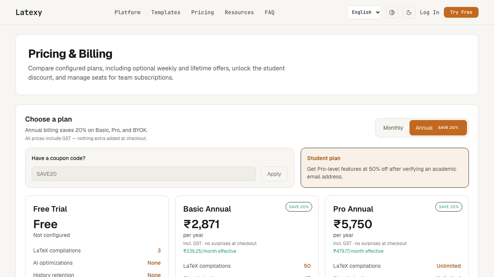
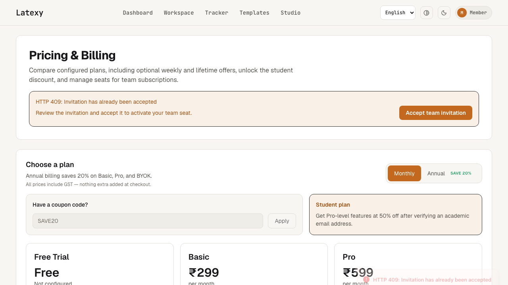

# Latexy product-flow QA audit — 2026-09-27

## Overall verdict

The captured local flow is visually coherent and usable at its primary desktop entry points. The landing page communicates the product promise quickly, the desktop editor exposes a credible compile-and-review workspace, and the mobile editor now shows a meaningful responsive improvement at 320×720. The highest-risk visible state is the team-invite retry: its error copy says the invitation is already accepted while the same screen asks the user to accept it, and the error is repeated in a transient toast.

This is a screenshot-backed UX/accessibility review, not a conformance certification. No full WCAG-compliance claim is made from these images.

## Audit scope

Evidence is limited to the six supplied screenshots from the local flow:

1. Landing viewport — 1280×720.
2. Public editor desktop — 1280×720.
3. Public editor mobile before — 320×720.
4. Public editor mobile after — 320×720.
5. Billing with Annual selected — 1280×720.
6. Team invitation retry/error state — 1280×720.

The screenshots were inspected at their native dimensions. Findings below describe only what is visible in those accepted images.

## Numbered flow audit

### 1. Landing viewport — Good

**Strengths**

- The headline “Your résumé, tailored — and you approve every line” states both the outcome and the human-review promise in one scan.
- The primary “Start compiling” action and secondary “See an example” action are visually distinct and placed next to the supporting copy.
- The résumé preview on the right makes the product concrete instead of relying on abstract marketing language.
- The dark surface, cream type, and blue accent create a consistent hierarchy; the main heading is easy to locate.

**UX and accessibility findings**

- The top navigation contains several equal-weight destinations before the primary “Try Free” action. This is acceptable for orientation, but the first-use path could be even clearer if the primary action remained the dominant next step at narrower widths.
- The language selector, two circular mode controls, and bottom-left circular control are visually compact. Their accessible names, keyboard focus, and hit areas cannot be verified from the image; they are worth checking in DOM and keyboard QA.
- The screenshot suggests strong text/background separation, but no measured contrast result should be inferred from appearance alone.

### 2. Public editor desktop — Good, with a dense control surface

**Strengths**

- The workspace has a recognizable three-part structure: project/source navigation, editable LaTeX, and a PDF preview area.
- “Saved locally,” “Recompile,” “Auto,” “Export,” and “Log in” make persistence, compile, and handoff actions visible in the top chrome.
- Line numbers, syntax coloring, and the `resume.tex` label support orientation in a code-editing task.
- The empty preview state explains what happens next: “Your PDF will appear here” and “Compile to render a live preview.”

**UX and accessibility findings**

- The preview occupies a large area while empty. The explanatory copy is helpful, but the state would be more actionable if it also pointed directly to the compile control or reflected compile progress/result in the same panel.
- The left rail is icon-only in the screenshot. The visual affordances are compact and may be efficient for experienced users, but their labels, focus order, and tooltips require interaction testing.
- The editor and status text are information-dense. Zoom, keyboard navigation, focus visibility, and screen-reader reading order are not observable here.

### 3. Public editor mobile before — Needs attention

**Observed issue**

- At 320×720, the top action row is too wide: the Export control is visibly cut by the right viewport edge, and the full desktop-style action set does not fit. This makes the mobile state look clipped rather than deliberately composed.
- The editor body itself remains legible enough to identify the source, but the clipped header reduces confidence that all required actions are reachable.

**Accessibility risk**

- A control that is visually clipped may still be technically focusable, but the screenshot cannot establish whether it is keyboard reachable, scrollable, or announced correctly. This is a responsive-reflow and discoverability risk, not a confirmed WCAG failure.

### 4. Public editor mobile after — Good visual fix

**Verified mobile fix**

- Comparing the two 320×720 captures, the after state reduces/recomposes the top chrome so the compact logo/play control, Export dropdown, and Log in action are visible within the viewport. The code pane also remains contained within the screen, with no visible horizontal scrollbar or right-edge clipping.
- The mobile Tools/Editor/PDF switcher and Auto control remain discoverable, so the main surface modes are still represented after the toolbar simplification.

**Evidence caveats**

- The red “N · 1 Issue” pill is the Next.js local-development diagnostic overlay, not Latexy product UI. It is excluded from the product finding, but its presence means this capture should not be treated as production-visual evidence for the lower status bar.
- The before and after captures use different visual themes (dark before, light after) and are not identical interaction states. The comparison therefore verifies the toolbar/reflow improvement only; it does not verify theme persistence, control parity, or compile behavior.

### 5. Billing — Annual plan selection — Mixed / needs polish

**Strengths**

- “Pricing & Billing,” the annual savings statement, the Annual selection, and the “SAVE 20%” badge make the pricing mode understandable at a glance.
- The page gives useful reassurance near the decision point: prices include GST, and effective monthly amounts are shown for annual plans.
- The coupon field, student-plan explanation, and plan cards are grouped into a predictable purchase sequence.

**UX and accessibility findings**

- Only the upper portions of the plan cards are visible at 720px; the primary plan actions and much of the feature comparison are below the captured viewport. This makes the screenshot insufficient to verify the final selection/checkout affordance.
- The monthly/annual switch appears to communicate state through the orange fill and text. The screenshot cannot confirm an accessible selected state (`aria-pressed`, a radio group, or equivalent), so this remains a semantic verification item rather than a confirmed defect.
- The “SAVE20” coupon value is shown inside the field, but the image alone cannot establish whether it is placeholder guidance or a prefilled value. A real field label and explicit validation feedback should be confirmed in the live UI.

### 6. Team invitation retry/error — Needs attention

**Strengths**

- The HTTP 409 state is surfaced prominently in an inline banner rather than leaving the user with a silent failure.
- The “Accept team invitation” action is large and easy to locate, giving the user a clear recovery path.
- The surrounding billing content remains visible, so the error does not blank the whole page.

**UX and accessibility findings**

- The message is contradictory: “Invitation has already been accepted” is followed by “Review the invitation and accept it to activate your team seat,” while the CTA again says “Accept team invitation.” Users cannot tell whether they should retry, open the team, contact the owner, or do nothing.
- The same HTTP 409 message is repeated in a bottom-right toast. The duplicate transient message competes with the persistent banner and appears partially clipped/faded at the viewport edge.
- The recovery copy should name the next valid state (for example, “This invitation is already accepted. Open your team workspace” or “The invitation is pending; try accepting again”) and reserve a retry action for a genuinely retryable condition.
- The banner and toast look like status/error messaging, but their alert/live-region behavior, focus movement, dismissal, and announcement timing cannot be verified from a screenshot.

## Cross-flow strengths

- The product has a consistent editorial visual language across marketing, editor, and billing surfaces: restrained palette, clear typography, and compact utility chrome.
- Core next actions are generally visible: start compiling, recompile, export, choose a billing period, and accept an invitation.
- The mobile editor after state shows deliberate responsive prioritization rather than simply shrinking every desktop control.

## Highest-priority opportunity areas

1. Resolve the team-invite 409 state into one truthful, state-specific message and one valid next action; suppress duplicate transient errors when the inline banner is already present.
2. Keep the mobile toolbar simplification and recheck its lower status bar in a production build without the Next.js development overlay.
3. Verify the billing-period control exposes its selected state to assistive technology and bring the plan action into a clearly discoverable position after the annual choice.
4. Audit icon-only editor and landing controls for accessible names, visible focus, target size, and reading order.

## Evidence limits and verification gaps

These screenshots do not establish DOM semantics, accessible names, keyboard order, focus visibility, screen-reader announcements, reduced-motion behavior, measured color contrast, browser zoom behavior, or full reflow at widths other than 320px and 1280px. They also do not prove that compile, export, checkout, coupon validation, or invitation acceptance succeeds on interaction. The team-invite image shows an HTTP 409 state, so only the visible recovery messaging was audited. The before/after mobile comparison changes theme and includes the Next.js development overlay, so only the layout/reflow change is treated as verified.

### Subsequent remediation — 2026-10-04

The invitation screenshot above is historical, not the current UI. Billing now
distinguishes terminal 403/404/409 responses from retryable failures, removes
invalid acceptance guidance/actions, and uses one inline error instead of a
duplicate toast. Both team and institutional invitation flows reject stale
token/account responses and require explicit acceptance. The production-mode
mocked browser suite passed these invitation scenarios; deferred hook tests
cover account changes and unmounts. This does not certify live invitations,
checkout, accessibility conformance, or production deployment.

No WCAG conformance or “fully accessible” claim is supported by this screenshot-only pass. Follow-up browser/DOM, keyboard, assistive-technology, and contrast testing is required before making that claim.
